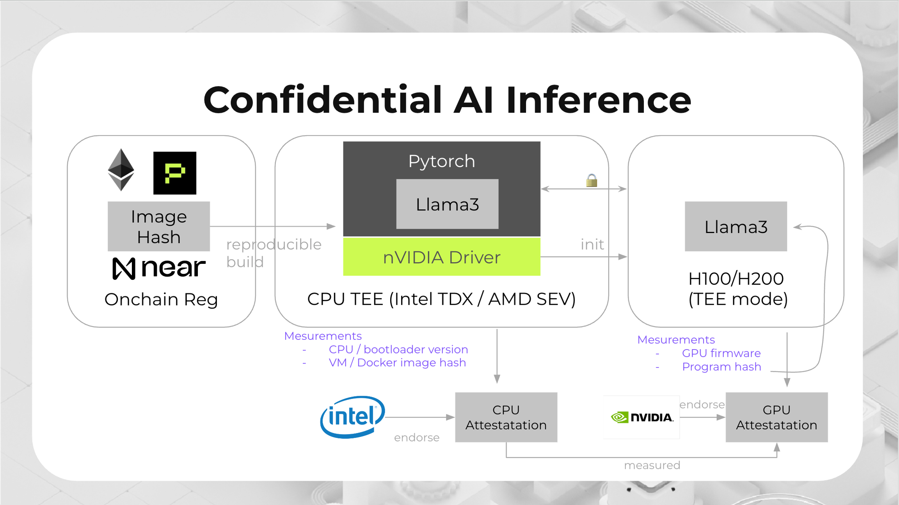

# Private ML SDK

A secure and verifiable solution for running Large Language Models (LLMs) in Trusted Execution Environments (TEEs), leveraging NVIDIA GPU TEE and Intel TDX technologies.



## Overview

Private ML SDK provides a secure environment for running LLM workloads with guaranteed privacy and security, preventing unauthorized access to both the model and user data during inference operations. The solution leverages NVIDIA's TEE GPU technology (H100/H200/B100) and Intel CPUs with TDX support to ensure that AI model execution and data processing remain fully protected within secure enclaves.

Key features:
- Tamper-proof data processing
- Secure execution environment
- Open source and reproducible builds
- Verifiable execution results
- Nearly native speed performance (up to 99% efficiency)

## Architecture

The system consists of several core components:

- **Secure Compute Environment**: TEE-based execution environment
- **Remote Attestation**: Verification of the TEE environment
- **Secure Communication**: End-to-end encryption between users and LLM
- **Key Management Service (KMS)**: Key management service to manage keys for encryption and decryption

## Getting Started

### Build the TDX guest image

Prerequisites:
- Install Docker:
  ```bash
  curl -fsSL https://get.docker.com -o get-docker.sh
  sudo sh get-docker.sh
  ```
- Add the current user to the docker group:
  ```bash
  sudo usermod -aG docker $USER
  newgrp docker  # Apply group changes without logout
  ```
- Verify Docker installation:
  ```bash
  docker --version
  docker run hello-world
  ```

Clone the repository and build the TDX guest image:

```
git clone https://github.com/nearai/private-ml-sdk --recursive
cd private-ml-sdk/
./build.sh
```

If everything goes well, you should see the images files in `private-ml-sdk/images/`.

There are two image directories:
- `dstack-nvidia-0.3.0/`: the production image without developer tools.
- `dstack-nvidia-dev-0.3.0/`: the development image with developer tools, such as `sshd`, `strace`.

### Run the TDX guest image

This requires a TDX host machine with the TDX driver installed and Nvidia GPU what support GPU TEE installed.

```
# Add the scripts/bin directory to the PATH environment variable
pushd private-ml-sdk/meta-dstack-nvidia/scripts/bin
PATH=$PATH:`pwd`
popd

# List the Available GPUs
dstack lsgpu

# Output like the following:
# Available GPU IDs:
# ID      Description
# 18:00.0 3D controller: NVIDIA Corporation GH100 [H200 SXM 141GB] (rev a1)
# 2a:00.0 3D controller: NVIDIA Corporation GH100 [H200 SXM 141GB] (rev a1)
# 3a:00.0 3D controller: NVIDIA Corporation GH100 [H200 SXM 141GB] (rev a1)
# 5d:00.0 3D controller: NVIDIA Corporation GH100 [H200 SXM 141GB] (rev a1)
# 9a:00.0 3D controller: NVIDIA Corporation GH100 [H200 SXM 141GB] (rev a1)
# ab:00.0 3D controller: NVIDIA Corporation GH100 [H200 SXM 141GB] (rev a1)
# ba:00.0 3D controller: NVIDIA Corporation GH100 [H200 SXM 141GB] (rev a1)
# db:00.0 3D controller: NVIDIA Corporation GH100 [H200 SXM 141GB] (rev a1)

# Choose one or more GPU IDs and run the following command to create a CVM instance
dstack new app.yaml -o my-gpu-cvm \
    --gpu 19:00.0 \
    --image images/dstack-nvidia-dev-0.3.3 \
    -c 2 -m 4G -d 100G \
    --port tcp:10022:22 \
    --port tcp:8888:8888

# Run the CVM:
sudo -E dstack run my-gpu-cvm
```

An example of the `app.yaml` file is as follows:

```yaml
# app.yaml
services:
  jupyter:
    image: kvin/cuda-notebook
    privileged: true
    ports:
      - "8888:8888"
    volumes:
      - /var/run/tappd.sock:/var/run/tappd.sock
    deploy:
      resources:
        reservations:
          devices:
            - driver: nvidia
              count: all
              capabilities: [gpu]
    runtime: nvidia
```

### Getting TDX quote inside the container

1. Install the SDK package:
```bash
pip install dstack-sdk
```

2. Get TDX quote using Python:
```python
from dstack_sdk import TappdClient

# Initialize the client
client = TappdClient()

# Get quote for a message
result = client.tdx_quote('test')
print(result.quote)
```

## Performance

Based on benchmarks running LLMs in NVIDIA H100 and H200:
- Efficiency approaches 99% as input size grows
- Minimal overhead for larger models (e.g., Phi3-14B-128k and Llama3.1-70B)
- Performance scales well with increased input sizes and model complexities
- I/O overhead becomes negligible in high-computation scenarios

## License

This project is licensed under the MIT License - see the [LICENSE](LICENSE) file for details.

## Contributing

Contributions are welcome! Please feel free to submit a Pull Request.

## References

- [NVIDIA Confidential Computing](https://www.nvidia.com/en-us/data-center/solutions/confidential-computing/)
- [Intel TDX Documentation](https://www.intel.com/content/www/us/en/developer/articles/technical/intel-trust-domain-extensions.html)
